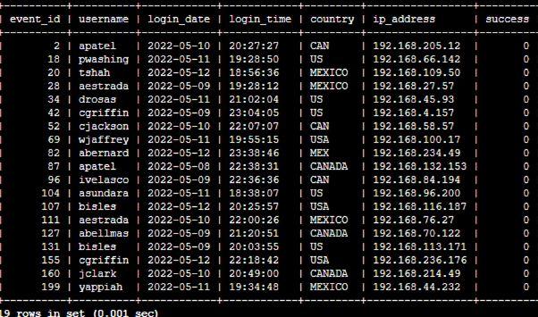
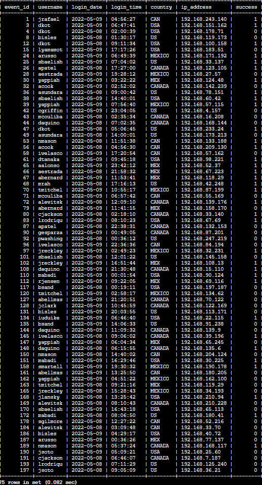
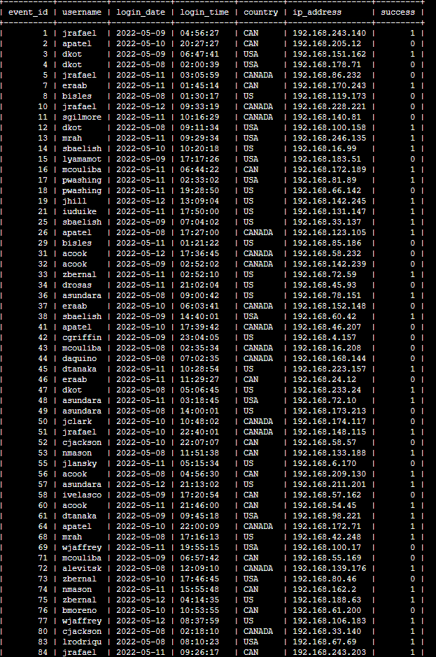
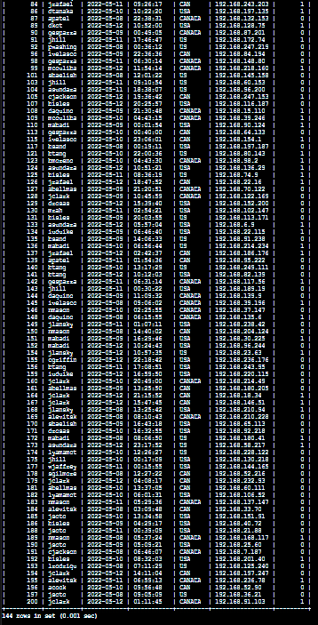
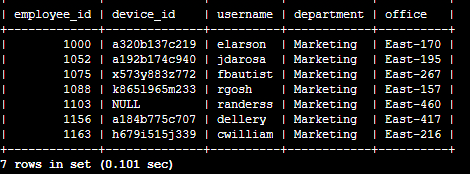
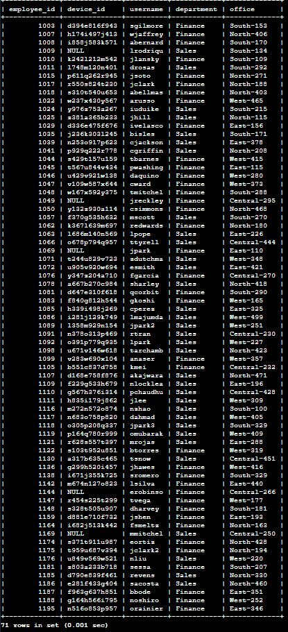
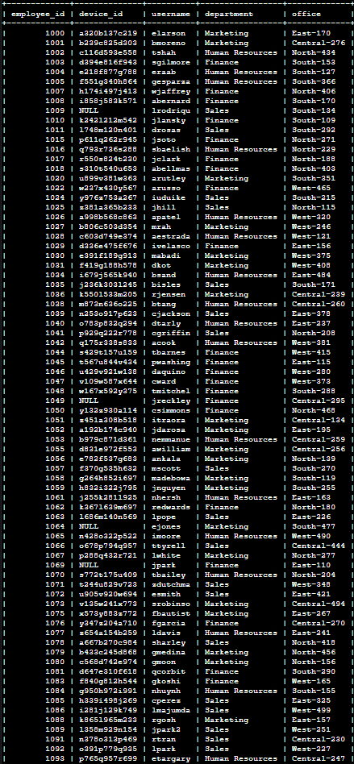
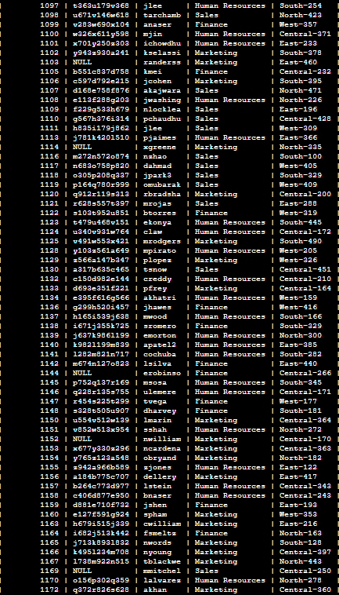
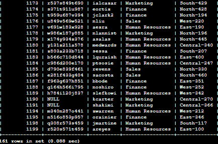

## Project description

I applied filters to SQL queries using `AND`, `OR`, and `NOT`. 

---
## Retrieve after hours failed login attempts

I recently discovered a potential security incident that occurred after business hours. To investigate it, I queried the `log_in_attempts` table for login attempts made after 18:00 that were unsuccessful. I used `AND` because I needed both conditions to be met.

The query returned 19 unsuccessful login attempts after 18:00 which helped me investigate patterns, such as the usernames `apatel`, `aestrada`, `cgriffin`, and `bisles` appearing twice on different days.

```sql
SELECT *
FROM log_in_attempts
WHERE login_time > '18:00' AND success = 0;
```



---
## Retrieve login attempts on specific dates

A suspicious event occurred on 2022-05-09. For this investigation I queried the `log_in_attempts` table and filtered for the dates `2022-05-09` and the day before so I could review the activity on those two days. I used `OR` because I needed every login attempt that matched either of the two dates.

The query returned 75 login attempts between the dates `2022-05-09` and `2022-05-08`, which allowed me to identify patterns such as repeated usernames. `daquino`, `dkot`, `sbaelish`, and `yappiah` each appeared 4 times, and I can review them in more detail for any suspicious activity.

```sql
SELECT *
FROM log_in_attempts
WHERE login_date = '2022-05-09' OR login_date = '2022-05-08';
```



---
## Retrieve login attempts outside of Mexico

There was suspicious activity with login attempts, but the team determined that it didn't originate in Mexico. For this investigation I queried the `log_in_attempts` table and used `NOT` and `LIKE` to get every login attempt made outside of Mexico. I used `%` as a wildcard to match both `MEX` and `MEXICO`, since the country appears in both formats.

The query returned 144 login attempts made outside Mexico, which allowed me to continue the investigation.

```sql
SELECT *
FROM log_in_attempts
WHERE NOT country LIKE 'MEX%';
```




---
## Retrieve employees in Marketing

My team wants to perform security updates on specific employee machines in the Marketing department. I queried the `employees` table and filtered it for `department` to be `Marketing`. I used `LIKE` with `East%` to get all the offices in the `office` column that are in the East building, no matter the number. I used `AND` because both conditions had to be met.

The query returned 7 employees in Marketing from the East building, which helped identify the machines that needed security updates. One of them (`randerss`) has a `NULL` device_id, so that machine would need to be checked separately.
 
```sql
SELECT *
FROM employees
WHERE department = 'Marketing' and office LIKE 'East%';
```



---
## Retrieve employees in Finance or Sales

My team now needs to perform a different security update on machines for employees in the Sales and Finance departments. I queried the `employees` table and filtered `department` for either `Sales` or `Finance`. I used `OR` because an employee can only be in one department.

The query returned 71 employees within the Sales and Finance departments. This allowed me to identify the machines that needed the update.

```sql
SELECT *
FROM employees
WHERE department = "Sales" OR department = "Finance";
```



---
## Retrieve all employees not in IT

My team needs to make one more update to employee machines. The employees who are in the Information Technology department already had this update, but employees in all other departments need it. I queried the `employees` table to get all employees from all departments except `Information Technology`. I used `NOT` to get every department but `Information Technology`.

The query returned 161 employees who are not in the `Information Technology` department. This helped me identify the machines that need the security update. Some employees have a `NULL` device_id, so those machines would need to be checked separately.

```sql
SELECT *
FROM employees
WHERE NOT department = 'Information Technology';
```




---
